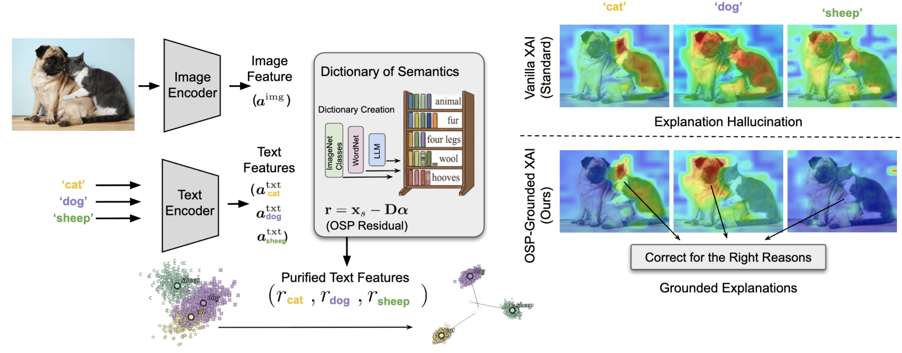
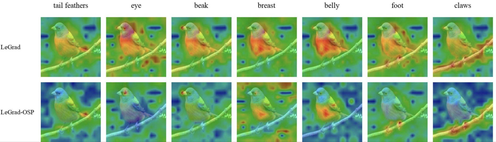
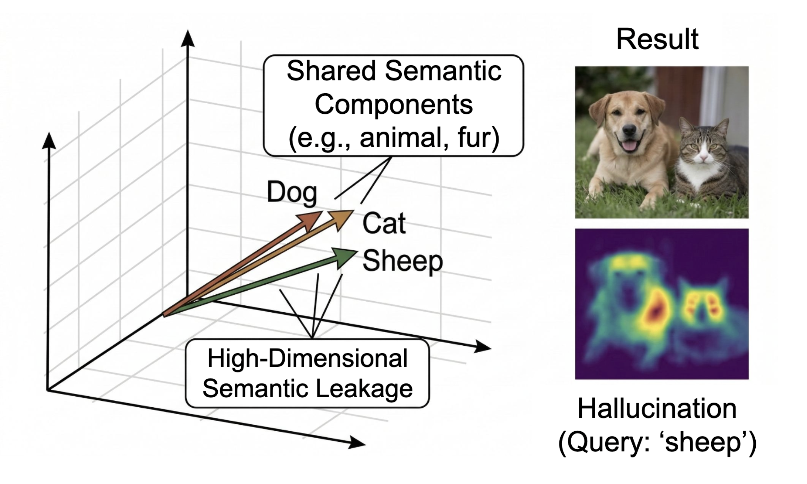

# Disentangling Hallucinations: Orthogonal Semantic Projection for Robust Interpretability

Official repository for the paper **"Disentangling Hallucinations: Orthogonal Semantic Projection for Robust Interpretability"**.

---

### Method Overview 
Explainability methods for Vision-Language Models (VLMs) like CLIP often suffer from **semantic hallucinations**—activating on concepts that are co-occurring, similar, or contextually related but not actually present in the image (false positives).



**Orthogonal Semantic Projection (OSP)** addresses this by leveraging Orthogonal Matching Pursuit (OMP) to identify and project out shared semantic components from text embeddings before computing explainability maps. This process disentangles hallucinated features from genuine visual activations, resulting in highly focused, semantically accurate explainability maps.

Overall Pipeline is as follows:

1. **Dictionary Construction**: Gather visual concepts and prompt embeddings.
2. **Orthogonal Semantic Projection (OSP)**: Project the target text embedding orthogonally to the dictionary space, stripping out overlapping semantic components.
3. **Robust Explanation Mapping**: Generate explainability maps on the projected residual, yielding cleaner maps with suppressed hallucinations.

---

## Qualitative & Quantitative Comparisons

### 1. Qualitative Benchmark
We evaluate OSP against multiple state-of-the-art explainability methods (including LeGrad, GradCAM, CheferCAM, AttentionCAM, and DAAM) on a variety of benchmarks. Below is a qualitative comparison grid on the "bird" visual concept:



### 2. Hallucination Suppression
The figure below demonstrates how standard explainability maps activate on competing or co-occurring concepts:



---

## Repository Structure

```
├── legrad/                 # Core Python package
│   ├── wrapper.py          # LeWrapper, LeGrad, and GradCAM wrappers
│   └── utils.py            # Attention hooks, normalizations, and visual utilities
├── scripts/                # Experimentation and evaluation suite
│   ├── sparse_encoding.py  # Core OSP / OMP algorithms (omp_sparse_residual, dictionary filtering)
│   ├── benchmark_segmentation.py  # Main evaluation script for image segmentation
│   ├── optimize_anti_hallucination.py # Hyperparameter optimization using Optuna
│   └── ...                 # Additional experimental scripts
├── paper/                  # Paper LaTeX source files (ignored by git)
│   ├── main.tex
│   └── appendix.tex
├── resources/              # Class indices and external configurations
├── setup.py                # Package setup script
└── requirements.txt        # Package dependencies
```

---

## Installation

### Prerequisites
- Python >= 3.7

### Setup
1. Clone the repository:
   ```bash
   git clone https://github.com/emirhanbilgic/Orthogonal-Semantic-Projection.git
   cd Orthogonal-Semantic-Projection
   ```

2. Install dependencies:
   ```bash
   pip install -r requirements.txt
   ```

3. Install the package in editable mode:
   ```bash
   pip install -e .
   ```

---

## Data Setup

The scripts expect datasets under a local `data/` directory.

| Dataset | Expected location | Used by |
| --- | --- | --- |
| ImageNet-Segmentation (`gtsegs_ijcv.mat`) | `scripts/data/gtsegs_ijcv.mat` | main quantitative benchmark, correlation, geometric verification |
| MS COCO 2017 (val images + annotations) | `data/coco/` | COCO appendix experiments |
| PartImageNet++ subset | `data/partimagenet_1000_subset/` | fine-grained part attribution |

You can override dataset locations without editing code via environment variables:

```bash
export PASCAL_VOC_ROOT=/path/to/pascal-voc-2012-DatasetNinja
export PASCAL_VOC_IMG_DIR=/path/to/pascal-voc-2012-DatasetNinja/trainval/img
```

All scripts write outputs to `outputs/` in the project root by default.

---

## Reproducing Paper Results

> Dictionary strategies: **S1** = ImageNet Classes, **S2** = ImageNet + WordNet, **S3** = Gemini 3 Flash (primary), **S4** = GPT-OSS 120B.
> Add `--device cuda` (or `mps`/`cpu`) to any script. Use `--limit N` for a quick smoke test before the full run.

### Run a single method with explicit OSP hyperparameters
`--methods` takes one of `original` (= LeGrad), `gradcam`, `chefercam`, `daam`, `daam_omp`; `--atoms` is the OMP sparsity budget (`0` disables OSP for a baseline); `--max_dict_cos_sim` drops dictionary atoms too similar to the target; the `--wn_use_*` / `--dict_include_prompts` flags control how the dictionary is built.

```bash
# LeGrad + CLIP, OSP with 10 atoms and a WordNet-siblings dictionary, on 200 images
python scripts/benchmark_segmentation.py \
    --methods original \
    --model_name ViT-B-16 --pretrained laion2b_s34b_b88k \
    --atoms 10 \
    --max_dict_cos_sim 0.6 \
    --wn_use_siblings 1 --dict_include_prompts 1 \
    --threshold_mode mean \
    --image_size 224 \
    --limit 200 \
    --device cuda
```

Swap the backbone to SigLIP with `--model_name ViT-B-16-SigLIP --pretrained webli`.

### Main quantitative results
mIoU / mAP / pixel-accuracy / AUROC, before and after OSP, for all method–model pairs and all four dictionary strategies:

```bash
# Full run (all 4,276 images), all dictionary creation strategies
python scripts/compute_image_level_auroc.py --strategies S1 S2 S3 S4 --limit 0

# Gemini 3 Flash strategy only, quick check on 100 images
python scripts/compute_image_level_auroc.py --strategies S3 --limit 100
```

Baseline (Base, no OSP) positive vs. negative prompt metrics:
```bash
python scripts/compute_positive_negative_baseline.py
```

### Qualitative / per-method heatmaps
```bash
python scripts/benchmark_segmentation.py \
    --mat_file scripts/data/gtsegs_ijcv.mat \
    --methods original,gradcam,chefercam,daam,daam_omp \
    --device cuda
```

### MS COCO (Appendix)
```bash
python scripts/compute_image_level_auroc_coco.py --strategies S1 S2 S3 S4 --limit 0
```

### Geometry of hallucination
```bash
# Cosine-similarity vs. hallucination correlation (Table A.x), then the binned-means figure
python scripts/cosine_similarity_hallucination_correlation.py
python scripts/plot_binned_means_paper.py

# Verify absent-class scores are near-zero (hallucination is geometric, not confusion)
python scripts/verify_geometric_hallucination.py --limit 4276
```

### Runtime (Appendix)
```bash
python scripts/benchmark_omp_runtime.py
```

### Dictionary-size ablation
Sweeps the number of OMP atoms (LeGrad + CLIP by default; add `--use_gradcam`, `--use_chefercam`, etc. to switch method):
```bash
# Gemini dictionary (S3)
python scripts/dictionary_size_ablation.py \
    --use_llm_dictionary --llm_dictionary_path scripts/visual_concept_dictionary_445.json --limit 0
```

### Fine-grained concept disambiguation (use cases)
```bash
python scripts/prompt_parts_all_methods.py        # bird parts
```

### PartImageNet++
```bash
python scripts/compute_partimagenet_omp.py
python scripts/visualize_partimagenet_omp.py
```

### Hyperparameter search (Optuna)
The per-strategy hyperparameter search can be done via:
```bash
python scripts/optimize_anti_hallucination.py --device cuda --n_trials 20
```
Increase the n_trials for more comprehensive search.
---

## Using OSP in your own code

OSP is a drop-in transform on a (unit-normalized) text embedding. The core is `omp_sparse_residual` in `scripts/sparse_encoding.py`:

```python
import torch.nn.functional as F
from scripts.sparse_encoding import omp_sparse_residual

# target: [1, d] L2-normalized text embedding of your query concept
# D:      [K, d] L2-normalized embeddings of distractor / dictionary concepts
r = omp_sparse_residual(target, D, max_atoms=8)   # purified, orthogonalized query
# feed `r` to any attribution method (LeGrad, GradCAM, CheferCAM, AttentionCAM, DAAM)
```

---

## Citation
If you find OSP or this codebase useful for your research, please cite our paper:

```bibtex
@article{bilgic2026disentangling,
  title={Disentangling Hallucinations: Orthogonal Semantic Projection for Robust Interpretability},
  author={Bilgi{\c{c}}, Emirhan and Caramiaux, Baptiste and Yan, Zhi and Franchi, Gianni},
  year={2026}
}
```
